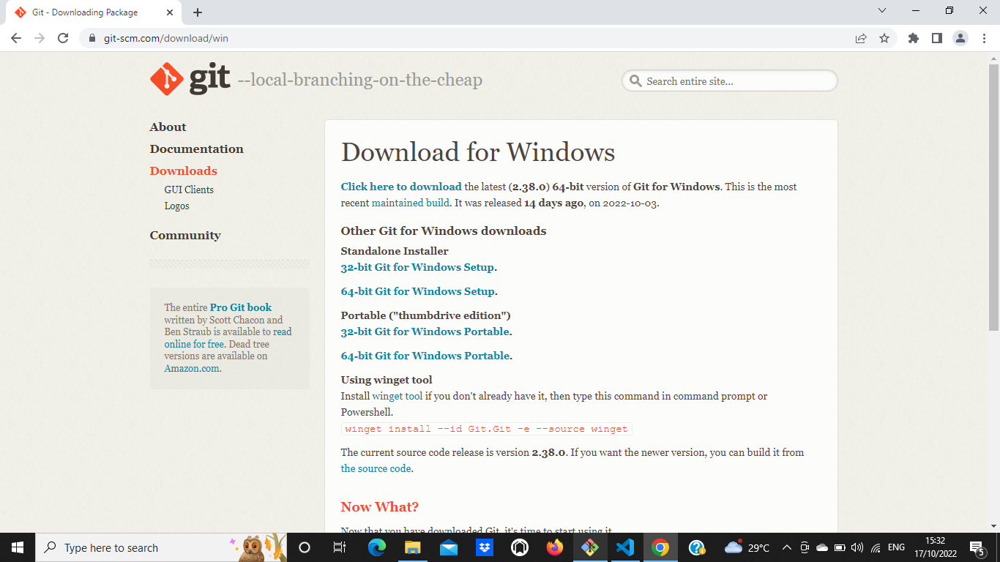
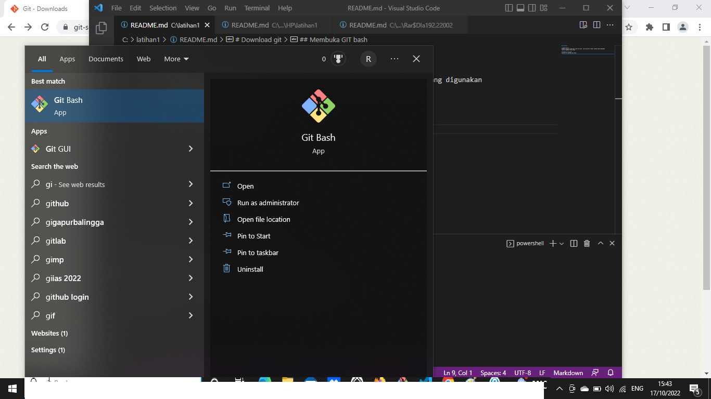
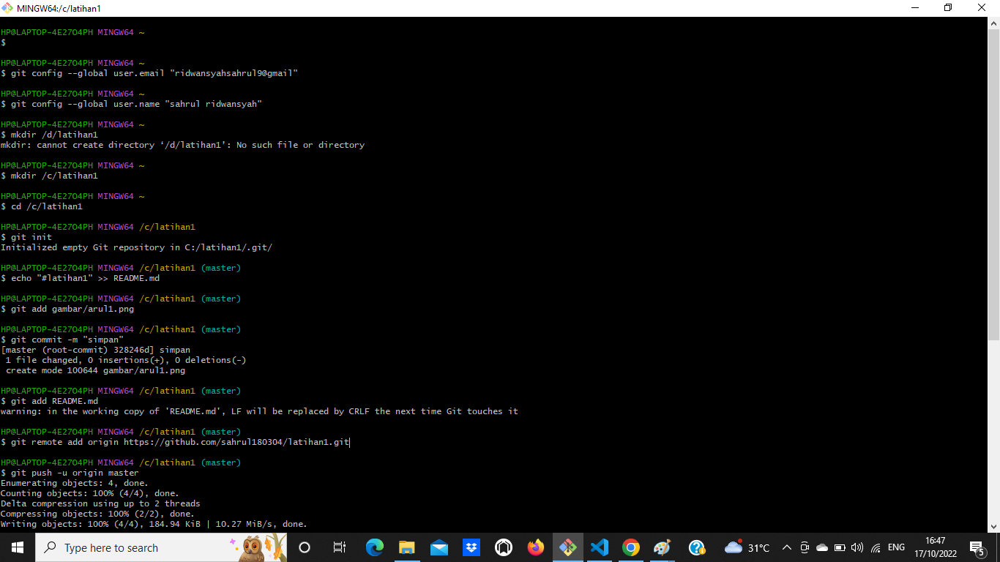
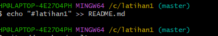
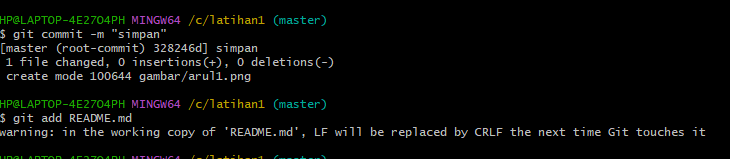
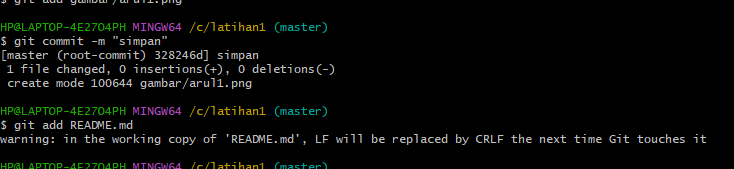
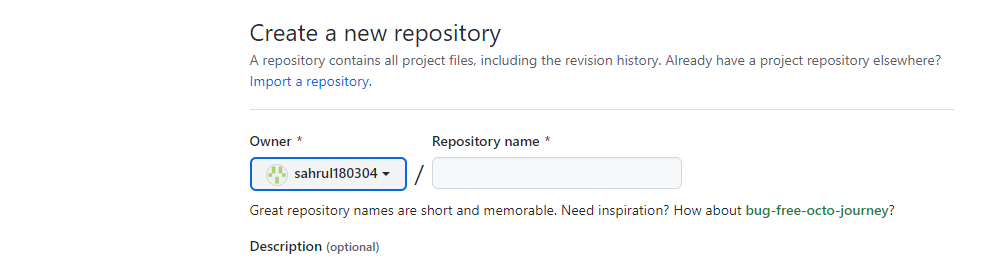
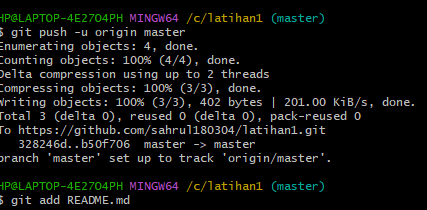
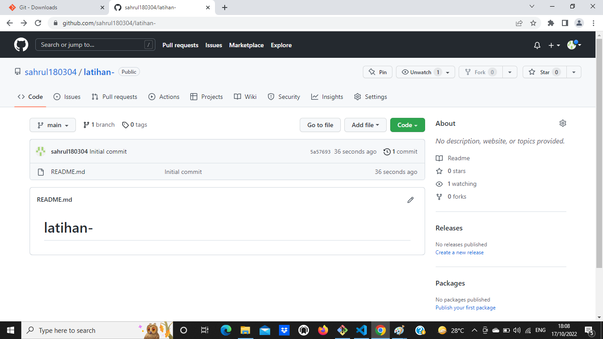
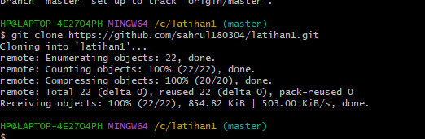

## latihan1 

# Download git
membuka website resmi git (git-scm.com), lalu diinstal sesuai laptop yang digunakan 


## Membuka GIT bash
setelah itu membuka git base 


## pembuatan global config 
pada saat pertama kali menggunakan git, kita perlu melakukan konfigurasi user.name dan user.email, konfigurasi ini bisa dilakukan untuk global repostirliy atau individual. belum dilakukan konfigurasi, akan mengakibatkan terjadi kegagalan saat menjalankan perintah git commit config global respsitory
``` 
$ git config --global user.name "name user"
$ git config --global user.email "email user"
```

## membuat repoeitory local 
buka direktory aktif, misal: d:\lab_pemrograman1 (buka menggunakan windows explorer), klik kanan pada direktory aktif, dan piluh menu git bash sehingga muncul git bash commit
```
$ mkdir latihan1
$ cd latihan1
```

sehingga terbentuk satu direktory baru dibawahnya, selanjutnya untuk kedalam direktory tersebut dengan perintah cd (change direktory)


## membuat repository local 
jalankan perintah git init, untuk membuat repository local.
```
$ git init 
```

repository baru berhasil di inisialisasi, dengan terbentuknya suatu direktory hidden dengan nama. git pada direktory tersebut, semua perubahan pada working directory akan disimpan.


## membuat menambahkan file baru pada repository
untuk membuat file dapat menggunakan text editor, lalu menyimpan filenya pada direktory aktif (repository)
```
$ echo "#latihan1" >> README.md
```


untuk menambahkan file yang baru saja dibuat gunakan printah git add
```
$ git add README.md
```


## menyimpan perubahan ke database(commit)
untuk menyiapkan perubahan yang ada kedalam database repositorylocal, gunakan perintah
```
$ git commit -m "simpan"
```


## membuat repository serever
server repository server yang digunakan http://github.com. anda harus membuatakun terlebih dahulu pada github klik tombol start aproject, atau dari menu (icon) klik atau repository

## membuat repository server 
isi nama repositorynya, misal:lab1. lalu klik create repository 


## clone repository 
clone  repository adalah meng--copy repository server dan secara otomatis membuat suatu direktory membuat suatu direktory sesuai dengan repositorynya (workingdirectory). untuk melakukan cloning, menggunakan printah 
```
$ git remote add origin https://github.com/sahru180304/latihan1.git
```

## mengirim perubahan ke server (push)
untuk mengirim perubahan pada local repository keserver menggunakan perintah git push
```
$ git push -u origin master
```
lalu perintah akan meminta masukan username dan pada akun github.com


## melihat hasilnya pada server repository
buka halaman github.com arahkan pada repositorynya, maka perubahan akan melihat pada halaman tersebut 


## clone repository 
clone repository adalah meng-copy repository server dan secara otomatis membuat suatu direktory sesuai dengan repositorynya (working direcktory). untuk melakukan cloning. menggunakan perintah
```
git clone [url]
```


